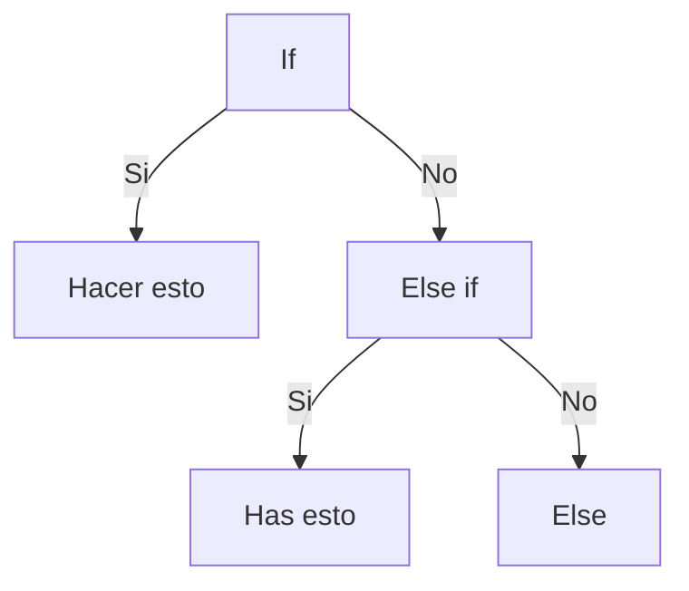
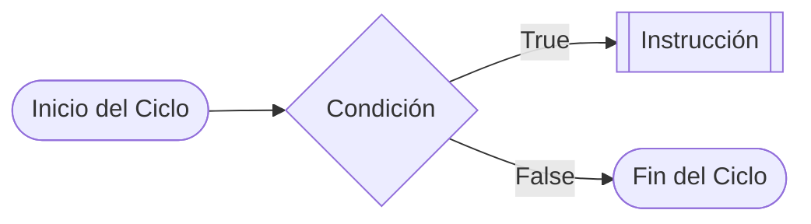

# Curso de PHP by Hector Ferro Dávalos
aquí almacenaré mi aprendizaje para es curso de PHP de la Universidad
aquí habrá una lista de lo que aprenderemos dentro del curso 
* ## PHP
Creado por Rasmus Lerdorf en 1994, PHP significa **Hypertext Pre-Processor**, es decir, pre-procesador de hipertexto.
Se utiliza en el backend para realizar paginas dinámicas
### Descargar PHP
[PHP For Windows: Binaries and sources Releases](https://windows.php.net/download#php-8.3)
descargar zip -> descomprimir y copiar en **C:\Program Files\php-8.3.1**
### Visual Code con PHP
[PHP Programming with Visual Studio Code](https://code.visualstudio.com/docs/languages/php)
seguir las instrucciones e instalar plugins de PHP
### Iniciando servidor PHP
`php -S localhost:8001`
utilizar terminal integrado de visual code:
(http://localhost:8001) + el archivo  o carpeta donde se encuentra el archvo a correr
ejemplo: http://localhost:8001/class/01-intro.php
## Hola mundo
```php
<?php
echo " Hola mundo";
?>
```
## Variables
Tipos de datos en PHP
- Escalares
	- Boolean: devuelve 1 valor verdadero o falso
	- integer: números positivos o negativos enteros incluido el 0
	- Float: números decimales de coma flotante
	- String: serie de caracteres PHP admite 256 caracteres
- Compuestos
- Especiales
para iniciar una variable se debe poner el signo **$**
```php
$nombre = "Hector";
$edad = 20;
$altura = 1.65;
$casado = true;
echo $nombre;
echo '<br>';
echo $edad;
echo '<br>';
echo $altura;
echo '<br>';
echo $casado;
echo '<br>';
// Para indicar el tipo de dato y el tamaño podemos utilizar
var_dump($nombre);
echo '<br>';
// pero tambien podemos utilizar
echo gettype($nombre);
```
## Constantes
Las constantes suele declararse en MAYÚSCULAS
```php
define('PULGADA',0.393701);
define('LIBRA',2.20462);
$cm = 50;
$kilo = 5;
echo $cm * PULGADA . '<br>';
echo $kilo * LIBRA. '<br>';
```
## Operadores
### Aritméticos
```php
echo '<h1>Operadores aritméticos</h1>';
$numero1 = 10;
$numero2 = 5;
//!suma (+)
echo $suma = $numero1 + $numero2 . "<br>";
//!resta (-)
echo $resta = $numero1 - $numero2 . "<br>";
//!multiplicación (*)
echo $multi = $numero1 * $numero2 . "<br>";
//!división (/)
echo $div = $numero1 / $numero2 . "<br>";
//!módulo (%)
echo $modulo = $numero1 % $numero2 . "<br>";
```
### Lógicos
```php
echo '<h1>Operadores lógicos</h1>';
$x = true;
$y = false;
//!and ($ and $) -> true si tanto $a como $b son true
echo $x and $y;
echo "<br>";
//!and ($ && $) -> true si tanto $a como $b son true
echo $x && $y = true;
echo "<br>";
//!or ($ or $) -> true si cualquiera de $a o $b es true
echo $x or $y;
echo "<br>";
//!or ($ || $) -> true si cualquiera de $a o $b es true
echo $x = false || $y = false;
echo "<br>";
//!xor ($ xor $) -> true si  $a o $b es true, pero no ambos
echo $x = true xor $y = true;
echo "<br>";
//!$ (not) -> true si $a no es true
echo !$x;
echo "<br>";
```
### Comparación
```php
echo '<h1>Operadores de Comparación</h1>';
$a = 10;
$b = 20;
//! $a == $b -> igual -> true si $a es igual a $b
echo $a == $b;//false
echo "<br>";
//! $a === $b -> idéntico -> true si $a es igual y del mismo tipo a $b
echo $a === $b;//false
echo "<br>";
//! $a != $b -> true si $a no es igual a $b
echo $a != $b;//true
echo "<br>";
//! $a <> $b -> true si $a no es igual a $b
echo $a <> $b;//true
echo "<br>";
//! $a !== $b -> true si $a no es igual ni del mismo tipo que a $b
echo $a !== $b;//true
echo "<br>";
//! $a > $b -> true si $a es mayor a $b
echo $a > $b;//false
echo "<br>";
//! $a >= $b -> true si $a es mayor o igual a $b
echo $a >= $b;//false
echo "<br>";
//! $a < $b -> true si $a es menor a $b
echo $a < $b;//true
echo "<br>";
//! $a <= $b -> true si $a es menor igual a $b
echo $a <= $b;//true
echo "<br>";
```
### Asignación
```php
echo '<h1>Operadores de Asignación</h1>';
//! += -> $a = $a +$b ->$a += $b
//* (+=),(-=),(*=),(/=),(%=)
$n1 = 4.5;
$n2 = 5;
//suma en asignación
echo $n1 += $n2;
echo "<br>";
echo $n1 -= $n2;
echo "<br>";
echo $n1 *= $n2;
echo "<br>";
echo $n1 /= $n2;
echo "<br>";
//echo $n1 %= $n2; Para aplicar %= se debe realizar con números enteros
echo "<br>";
echo fmod($n1 , $n2);
```
## Condicionales

### Condicionales Simples
#### If
*realizar un programa que envié un mensaje solo si este contiene menos de 100 letras caso contrario que arroje un mensaje de error*
```php
//!strlen permite contar los caracteres de una cadenas
$letras = "Hola, estamos aprendiendo a escribir código";
if (strlen($letras) < 100) {
    echo "El mensaje tiene: ".strlen($letras)." letras";
}else {
    echo "error";
}
echo'<br>';
```
#### elseif
*crear un programa que indique si los habitantes hablan español u otro idioma*
```php
$idioma = "español";
if ($idioma == "español") {
    echo "el habitante habla español";
}elseif($idioma == "ingles"){
    echo "el habitante habla ingles";
}else{
    echo "el habitante habla otro idioma fuera de la lista";
}
echo'<br>';
echo'<br>';
//otra forma
$pais = "Peru";
if ($pais == "Mexico"||$pais == "España"||$pais == "Peru") {
    echo "Hablan español";
}else{
    echo "habla otro idioma";
}
```
#### Ternarios
*Para que un alumno domine una asignatura debe sacar mas de 14 en la nota definitiva, caso contrario no aprendió nada
```php$nota =  14;
echo ($nota  > 13 ? 'aprobaste el curso satisfactoriamente':'no aprendiste nada');
echo '<br>';
```
 pierde la asignatura*
#### Switch
*Realiza un programa que imprime cual es tu color favorito, mostrar un ejemplo*
```php
$variable = 'verde';
switch ($variable) {
    case 'marron':
        echo "tu color favorito es: ". $variable;
        break;
    case 'verde':
        echo "tu color favorito es: ". $variable;
        break;
    case 'azul':
        echo "tu color favorito es: ". $variable;
        break;
    default:
        echo "no se que hiciste xd";
        break;
}
```
### Actividad
*Teniendo en cuenta la tabla, te piden que escribas un programa que solicite el nombre del cliente y el valor de la compra. Y que arroje como resultado:*
```php
$nombre = 'Hector';
$compra = 300;
if ($compra < 50) {
    $descuento = $compra - ($compra * 0.05);
}else if($compra >= 50 and $compra <100){
    $descuento = $compra - ($compra * 0.1);
}else if($compra >= 100 and $compra <= 250){
    $descuento = $compra - ($compra * 0.15);
}else if($compra > 250 and $compra < 400){
    $descuento = $compra - ($compra * 0.2);
}

echo 'Nombre del cliente: '. $nombre.'<br>';
echo 'valor de compra sin descuento: '.$compra.'<br>';
echo 'valor de compra con descuento: '.$descuento.'<br>';
```
## Ciclos


 